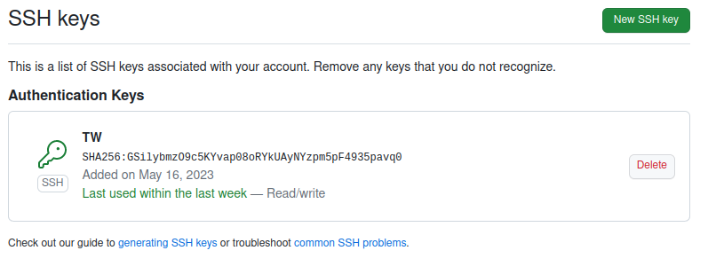
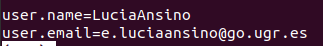

# Localizador

## Problema

Soy el dueño o empleado de una cooperativa de aceite y necesito saber en que sala de la cooperativa se encuentran el resto de compañeros, para poder localizarlos con mayor facilidad. También, es crucial llevar un registro de donde ha estado cada empleado a que horas a lo largo del día y evitar que algunas salas se queden desatendidas por los empleados, por ejemplo, la sala donde se atiende a los clientes.

Por lo que, se dirá donde se encuentra un empleado en el instante de la consulta y también la gente qu hay en ese instante en una sala concreta. Además, se deberá poder consultar un historial que indique donde ha estado el empleado el día deseado y un historial para ver quién ha estado en cada sala. Tambié, en caso de que haya alguna sala sin nadie del personal se deberá de indicar y mandar a un empleado que se encuentre en una sala donde ya hay más empleados.

## Claves de github

## Configuración de nombre y correo electrónico

