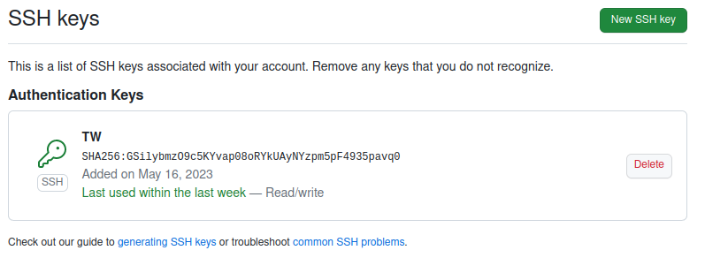
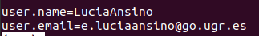

# Información de productos comprados

## Problema

Soy una persona que al realizar una compra en un comercio de alimentos donde el ticket es electrónico, debo de pasar de forma manual cada producto comprado a una lista donde veo la comida y la cantidad comprada. Esto es para tener disponible dicha información y evitar comprar alimentos que ya tengo, pero desperdicio mucho tiempo añadiendo a dicha lista la información de cada compra que realizo.

## Claves de github

## Configuración de nombre y correo electrónico

## Historias de usuario

## Milestone

